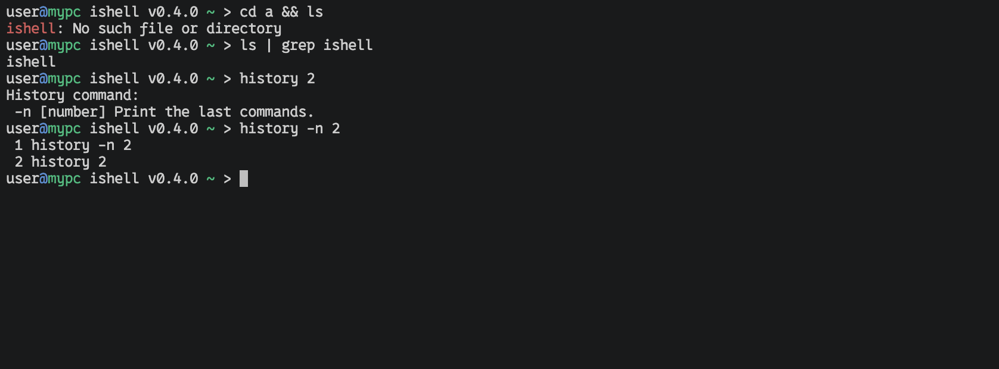

# ishell

ishell is a shell, which aims to build a modern, simple and close alternative to the classic Unix bourne shells.
This is a learning project.
You can configure the shell with a TOML file, please refer to the Github wiki for more info.

